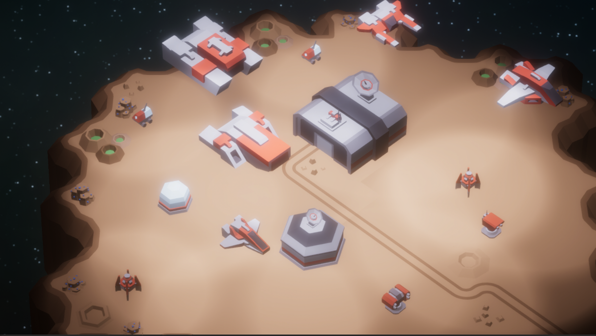

## Synopsis

Server Authoritative Multiplayer Space\SciFi Themed Real-Time Strategy Game using Unity-2020.2.1 in URP & Mirror Networking

## Packages and Assets

Cinemachine-2.6.3 | InputSystem-1.0.1 | ProBuilder-4.4.0 | MirrorNetworking-30.2.2 | ParrelSync-1.4.1 | DOTween-1.2.420 | Kenney's 3D-SpaceKit

## Motivation

This sample game project consists of FREE Packages and Assets. You may use and extend it in anyway you like. The main purpose of this repo, is to share what I know about making a server authoritative multiplayer 3D Unity game and to give back to the community. 

## Details

All models are Probuilderized, some re-modeled with Probuilder, and their UVs are re-arranged so Game uses just a single Material with a single Texture Atlas for all models. 

## License

MIT License

Copyright (c) 2021 Jon Zorlu

Permission is hereby granted, free of charge, to any person obtaining a copy
of this software and associated documentation files (the "Software"), to deal
in the Software without restriction, including without limitation the rights
to use, copy, modify, merge, publish, distribute, sublicense, and/or sell
copies of the Software, and to permit persons to whom the Software is
furnished to do so, subject to the following conditions:

The above copyright notice and this permission notice shall be included in all
copies or substantial portions of the Software.

THE SOFTWARE IS PROVIDED "AS IS", WITHOUT WARRANTY OF ANY KIND, EXPRESS OR
IMPLIED, INCLUDING BUT NOT LIMITED TO THE WARRANTIES OF MERCHANTABILITY,
FITNESS FOR A PARTICULAR PURPOSE AND NONINFRINGEMENT. IN NO EVENT SHALL THE
AUTHORS OR COPYRIGHT HOLDERS BE LIABLE FOR ANY CLAIM, DAMAGES OR OTHER
LIABILITY, WHETHER IN AN ACTION OF CONTRACT, TORT OR OTHERWISE, ARISING FROM,
OUT OF OR IN CONNECTION WITH THE SOFTWARE OR THE USE OR OTHER DEALINGS IN THE
SOFTWARE.